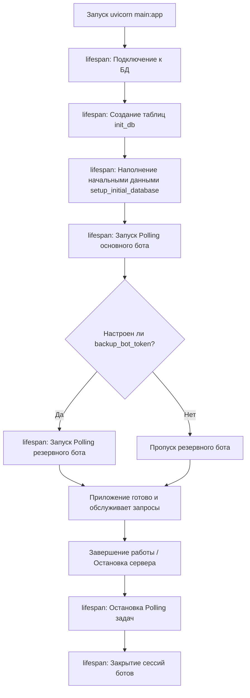

# Архитектура и Руководство по Резервному Копированию (Vape Shop Bot)

Этот документ содержит детальное описание архитектуры проекта, жизненного цикла приложения, схемы работы с Telegram-ботами, а также руководство по обеспечению фундаментальной отказоустойчивости, очистке и резервному копированию базы данных.

---

## 1. Схема работы и инициализации приложения

Приложение совмещает в себе асинхронный веб-сервер **FastAPI** (для обслуживания API Mini App и панели администратора) и двух независимых Telegram-ботов на библиотеке **Aiogram 3.x** (основной бот для клиентов и резервный бот для администратора).

### Схема жизненного цикла (Lifespan) в [main.py](file:///Users/dmitriyliakhovets/Documents/Baryga_Proj/main.py):



### Основные пути и файлы инициализации:

1. **Загрузка конфигурации**:
   - Путь: [core/config.py](file:///Users/dmitriyliakhovets/Documents/Baryga_Proj/core/config.py)
   - При старте `Settings()` считывает переменные из окружения или файла `.env` с помощью библиотеки `pydantic-settings`.
   - Автоматически трансформирует стандартную строку подключения PostgreSQL (`postgresql://...` или `postgres://...`), генерируемую Railway, в асинхронный формат `postgresql+asyncpg://` для корректной работы SQLAlchemy.

2. **Подключение к БД**:
   - Путь: [core/database.py](file:///Users/dmitriyliakhovets/Documents/Baryga_Proj/core/database.py)
   - Создается асинхронный движок SQLAlchemy (`create_async_engine`) и фабрика сессий `async_session_maker`.
   - В функции `init_db()` регистрируются все модели данных из [core/models.py](file:///Users/dmitriyliakhovets/Documents/Baryga_Proj/core/models.py) и создаются таблицы (если они отсутствуют).

3. **Инициализация ботов и роутеров**:
   - Путь: [main.py](file:///Users/dmitriyliakhovets/Documents/Baryga_Proj/main.py)
   - Основной клиентский бот инициализируется глобально через `settings.bot_token`. К нему подключаются роутеры `start_router` и `admin_router`.
   - Резервный бот инициализируется глобально через `settings.backup_bot_token` (если переменная задана). К нему подключается изолированный `backup_router`.

---

## 2. Схема работы с переменными окружения

Программа считывает настройки из системного окружения (Environment) или локального файла `.env`.
Все переменные описаны в [core/config.py](file:///Users/dmitriyliakhovets/Documents/Baryga_Proj/core/config.py):

* `BOT_TOKEN` — API токен основного бота для покупателей.
* `MINI_APP_URL` — ссылка на веб-интерфейс (Mini App).
* `DATABASE_URL` / `POSTGRES_URL` — строка подключения к базе данных PostgreSQL.
* `ADMIN_CHAT_ID` — ID чата, куда приходят уведомления о новых заказах и заявки на пополнение.
* `BACKUP_BOT_TOKEN` — API токен резервного/административного бота.
* `BACKUP_ADMIN_ID` — Ваш личный Telegram ID (число), которому разрешено управлять резервным ботом.

---

## 3. Методы добавления и удаления данных в БД (SQLAlchemy)

### Как добавляются данные в коде:
Для работы с базой данных используется **SQLAlchemy ORM**. Добавление новой записи происходит через сессию:
1. Создается экземпляр модели: `new_item = ModelClass(field1=value1, ...)`
2. Добавляется в сессию: `session.add(new_item)`
3. Изменения сохраняются: `await session.commit()` (или `await session.flush()`, чтобы получить автогенерируемый ID до коммита).

**Примеры в коде:**
* Создание заказа: файл [api/routes/orders.py](file:///Users/dmitriyliakhovets/Documents/Baryga_Proj/api/routes/orders.py#L97-L115) (строка `db.add(new_order)`).
* Сохранение выигрыша Колеса фортуны: файл [api/routes/fortune.py](file:///Users/dmitriyliakhovets/Documents/Baryga_Proj/api/routes/fortune.py#L90-L108) (строки `db.add(new_bonus)` и `db.add(new_history)`).
* Начальный посев товаров: файл [core/database.py](file:///Users/dmitriyliakhovets/Documents/Baryga_Proj/core/database.py#L36-L59) (метод `session.add_all([...])`).

### Как удаляются данные в коде:
Удаление выполняется либо через асинхронную сессию по объекту:
```python
await session.delete(instance)
await session.commit()
```
Либо через массовый SQL-запрос `delete()` (чтобы очистить таблицу целиком или удалить группу строк по фильтру):
```python
from sqlalchemy import delete
await session.execute(delete(ModelClass).where(ModelClass.field == value))
await session.commit()
```

---

## 4. Резервный бот и команды экстренной очистки

В резервный бот (модуль [bot/handlers/backup.py](file:///Users/dmitriyliakhovets/Documents/Baryga_Proj/bot/handlers/backup.py)) зашит административный функционал, доступный **исключительно владельцу `BACKUP_ADMIN_ID`**. Все остальные пользователи полностью игнорируются.

### Доступные команды управления и очистки:
* `/start` — Показать приветствие и меню.
* `/backup` — Генерация полной резервной копии всей БД в файл JSON и его отправка в чат.
* `/users` — Список первых 30 клиентов, их баланс и бонусы.
* `/clear_spins` — Сброс истории кручений (`FortuneHistory`). Очищает таблицу, позволяя всем пользователям сразу крутить Колесо заново (снимает ограничение 24 часа).
* `/clear_bonuses` — Удаляет все выигранные купоны и неиспользованные подарки пользователей (`UserBonus`). Помогает сбросить выданные бонусы, если была допущена критическая ошибка в призах.
* `/clear_prizes` — Полностью удаляет доступный пул призов (`FortunePrize`). После этого нужно будет повторно наполнить БД призами (например, через `seed_db.py`).

---

## 5. Как жестко зашить API-ключи и ID в код («Фундаментально»)

Если вы хотите быть абсолютно уверенными, что боты запустятся на любом сервере даже без настроенных переменных окружения, пропишите значения напрямую в файл [core/config.py](file:///Users/dmitriyliakhovets/Documents/Baryga_Proj/core/config.py):

```python
# Измените значения Field(default=...) на ваши реальные:
backup_bot_token: Optional[str] = Field(default="8917843683:AAHtq7Kyp_8ZbPrCQVyVWIqkRjH1pPcnz-U", description="Токен бота")
backup_admin_id: Optional[int] = Field(default=1115714808, description="ID чата бота")
```

При таком подходе программа автоматически применит эти данные при отсутствии переменных в `.env`.

---

## 6. План экстренного восстановления при отключении Railway

1. Периодически вызывайте `/backup` в резервном боте и сохраняйте JSON-файл на ПК.
2. При отключении Railway установите бота на другой сервер/компьютер.
3. Настройте подключение к новой базе данных (например, локальной SQLite `sqlite+aiosqlite:///./vape_shop.db` в `DATABASE_URL`).
4. Запустите скрипт восстановления:
   ```bash
   python restore_db.py <имя_файла_бэкапа>.json
   ```
5. Скрипт [restore_db.py](file:///Users/dmitriyliakhovets/Documents/Baryga_Proj/restore_db.py) автоматически создаст таблицы и импортирует туда все данные клиентов, товаров и заказов.
